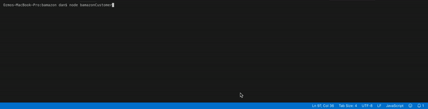

# UNCC Coding Bootcamp

## Bamazon Customer Node + MYSQL

#### Description

1. The app should then prompt users with two messages.

   * The first should ask them the ID of the product they would like to buy.
   * The second message should ask how many units of the product they would like to buy.

2. Once the customer has placed the order, your application should check if your store has enough of the product to meet the customer's request.

   * If not, the app should log a phrase like `Insufficient quantity!`, and then prevent the order from going through.

3. However, if your store _does_ have enough of the product, you should fulfill the customer's order.
   * This means updating the SQL database to reflect the remaining quantity.
   * Once the update goes through, show the customer the total cost of their purchase.

#### The Working Application Gif

#### Description

This simple node javascript application uses NODE and MYSQL to emulate a text-only shopping experience at a non-existant online shopping property. 

#### What was used?

**MYSQL  NODE PACKAGE**

MYSQL, an open-source database application was running locally through MAMP. We required the native MYSQL package. 

**INQUIRER NODE PACKAGE**

INQUIRER provides a text user-interface in a "questions and answers" format for a NODE application. This is how we collect user input.